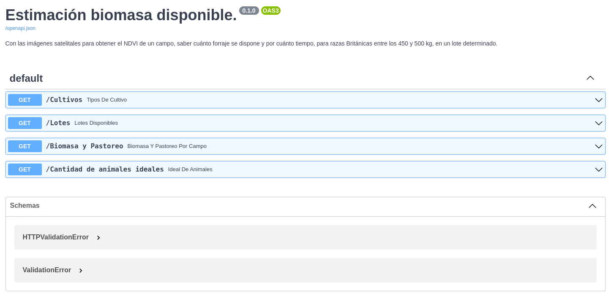
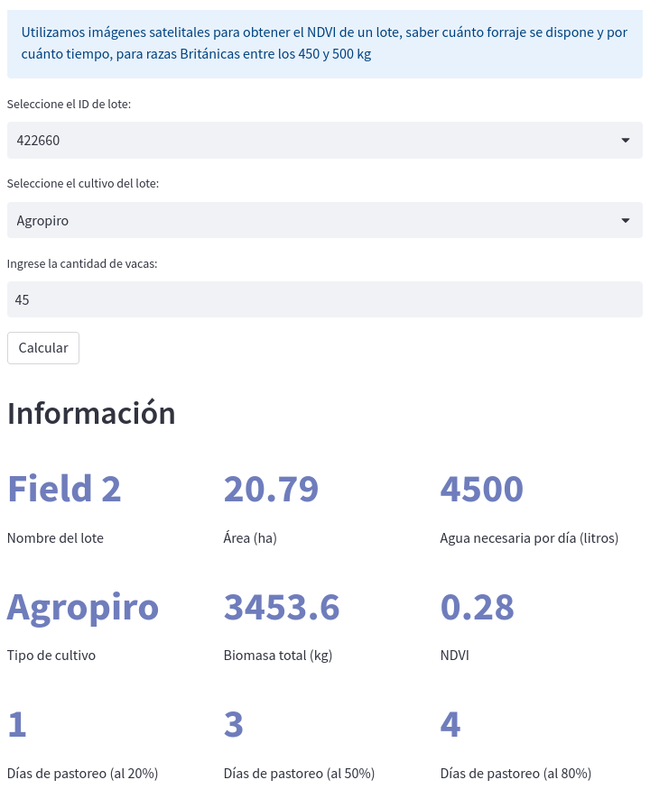
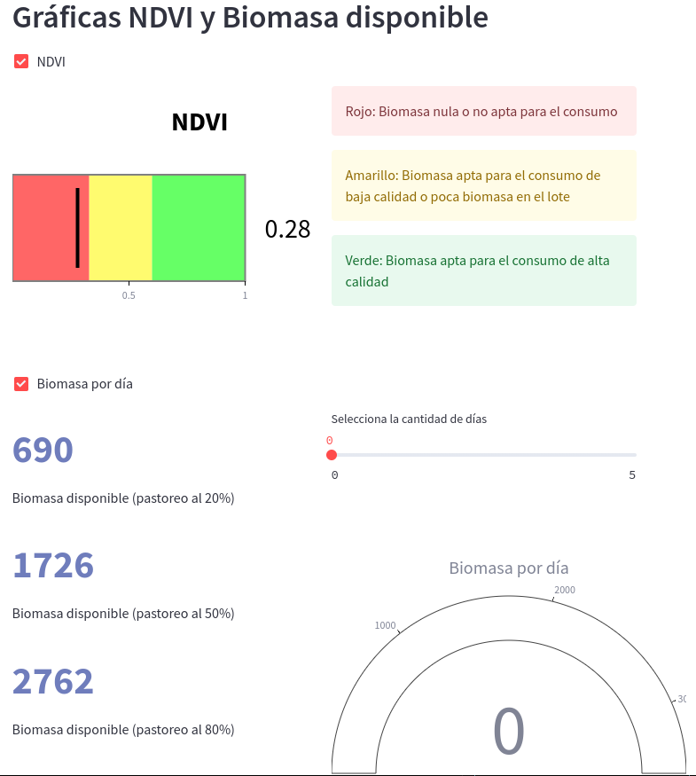

<div id = "header" align = "center">
  
</div>


# Bastó

[Bastó](https://www.bastó.com.ar/) es un sistema basado en IoT (Internet de las cosas) que utiliza caravanas inteligentes para implementar una cerca virtual dinámica, la cual monitorea de manera constante la ubicación, salud y bienestar del ganado, permitiendo así un pastoreo de precisión.

La empresa propone una solución para mejorar la producción y el uso de pasturas en grandes potreros, mediante la subdivisión de estos en lotes más pequeños y el control del ganado a través de cercas virtuales como de dispositivos inteligentes que monitorean, contienen y dirigen al ganado, optimizando finalmente las dinámicas de pastoreo. Esta tecnología permite reducir costos de infraestructura, mano de obra y tiempo, asimismo mejora la calidad del pastoreo y se aumenta su productividad.

<div id = "header" align = "center">
  <h1 align = 'Center'> Stack tecnológico </h1>
   &nbsp;
   &nbsp;
   &nbsp;
   &nbsp;
   &nbsp;
   &nbsp;
   &nbsp;
   &nbsp;
   &nbsp;
   &nbsp;
   &nbsp;
    &nbsp;

</div>

# Ejecución del Código
Este repositorio presenta diferentes etapas para la ejecución plena del código, donde finalmente se obtiene el dashboard. Este porceso consta de 2 etapas; primero la extracción, transfomación y carga del dataset a emplear (ETL), el segundo paso conta de la ejecucion de la api mediante [FastAPI](https://fastapi-basto-project.onrender.com/docs) y de la app de [Streamlit](https://basto-project.onrender.com).

## Dataset
Para este proyecto se extrajo el dataset de 3 fuentes distintas.

### Auravant
[Auravant](https://www.auravant.com/) es la herramienta digital la cual nos permite extraer información relevante sobre los campos y lotes, acerca del actual estado de los cultivos y los suelos mediante imágenes satelitales. Principalmente, extraemos de esta herramienta el Índice Verde o Normalized Difference Vegetation Index (NDVI), a través de su [API](https://developers.auravant.com/docs/apis/reference/api_ref_gral/). Para automatizar este proceso de extraer data relevante para el proyecto se crea el script de python
```
auravant_api.py
```
Este archivo realiza consultas automaticas a la API de auraventa, transformado los datos a DataFrames de pandas para tratar posteriormente con datos como el ID del lote, su nombre, las dimensiones del mismo, su area, y más importante su NDVI.

### Tablas de Control Forrajero
Uno de los objetivos fundamentales del proyecto consta en calcular la biomasa de un determinado lote relacionado con un cierto usurio. Sin embargo, es necesario conocer los valores de biomasa para distintos tipos de vegetación. Para ello la página web de [Tablas de Control Forrajero](https://tableroforrajero.crea.org.ar/dashboardcrea2/index.php/crea_session_manager) oferece un extenso dataset sobre la producción mensual de cada vegetación a lo largo de Argentina y parte de Uruguay. Debido a la gran cantidad de datos a descargar se crea el archivo **tcf_scrapping.py** el cual automatiza este proceso de descarga gracias a la librería **Selenium** que emplea el navegador **FireFox** para la obtención de los datos. Para realizar este proceso se ha de correr el siguiente comando:
```
python3 tcf_scraping.py .(pwd)/dataset/
```
Siendo **.(pwd)/dataset/** el path absoluto a la carpeta de descarga. Por otro lado, este proceso es opción realizarlo, puesto que en el directorio **./dataset/** se encuentra el resultado final de esta ejecución, es decir, el archivo **./dataset/All_Harvest.csv** contiene ya todos los datos necesarios para trabajar.

### BASTÓ Dataset
Como último dataset necesario para este proyecto es el dataset proporcionado por la Start-Up argentina BASTÓ. Este dataset no se encuentra en este repositorio por razones de privacidad. Sin embargo, si se llega a contar con esta base de datos en MongoDB, solo es necesario correr el siguiente comando:
```
python3 mongodb.py
```
 
## FastAPI
Como se mencionó anteriormente, se ha realizado una [API](https://fastapi-basto-project.onrender.com/docs) con el proposito de que se pueda consumir los datos finales de forma adecuada y eficiente. Para ello se ha hecho un deploy mediante [render](render.com).


## Streamlit App
Por otro lado, como alternativa al usuario se ha creado una [app](https://basto-project.onrender.com) empleado streamlit. En esta app el usuario puede monitorear el estado de los cultivos, asimismo la actidad actual de biomasa en el lote, las areas consumidas por el ganado, además de aquellas areas remanentes.




En la última imagen se visualiza las área mayormente ocupadas por el ganado (representadas por las regiones más oscuras), contrariamente las áreas claras son aquellas donde el ganado poco ha pastado.

Visualizar el mapa de calor mediante el [render](https://basto-project.onrender.com) puede ser muy lento, por ello si se requiere de rápidas consultas se recomienda correr la app localmente con el siguiente comando:
```
streamlit run Index.py
```

# Conclusiones
A partir de las imágenes satelitales ofrecidas por [Auranvant](https://www.auravant.com/) y de las [Tablas de Control Forrajero](https://tableroforrajero.crea.org.ar/dashboardcrea2/index.php/crea_session_manager) logramos estimar la biomasa promedio en un determinado lote o zona sugerida por el cliente, utilizando también la cantidad de animales y el tipo de cultivo en el lote, podemos entregarle información relevante al usuario sobre la cantidad de días que pueden los animales pastorear consumiendo únicamente el 20%, 50% u 80% del total de biomasa, con el fin de promover la adecuada recuperación de los suelos.

Contrariamente, el usuario puede disponer de cuantos animales ingresar a una determinada zona para realizar un pastoreo por un tiempo fijo. Es decir, si el usuario desea realizar un pastoreo por n días, la aplicación retornará el número de animales adecuado para consumir nuevamente el 20%, 50% u 80% del total de biomasa.

Finalmente, también el usuario dispone de un mapa de calor donde puede visualizar la actividad de su ganado durante un rango de tiempo elegido por el mismo; siendo las zonas más oscuras aquellas donde los animaels han pasado más tiempo y posiblemente has consumido gran cantidad de vegetación, contrariamente en las zonas claras el ganado ha pastoreado poco o directamente nada.
